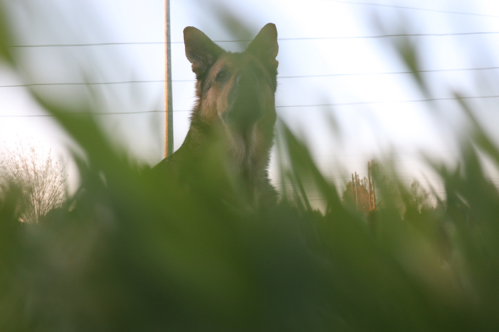

<h1>Hi, I'm Devri!</h1>

<h2>🔭 I’m currently working on:</h2>

- <b>Capstone Project: Dating App For Animal Adoption (Pawsome)</b>

Pawsome is a pet adoption web application designed to connect animals with their furever home.

The application allows potential adopters to create accounts, select pet preferences, and start matching with their future pet.

Animal shelter admins can register, upload pet profiles, and manage pet profiles through a designated dashboard. 

Built using Next.js, Typescript, and Directus for the backend, the platform enables a simple way to find pets from multiple shelters in a central place.

<h2> 🤳 Connect with me:</h2>

[][linkedin]

[linkedin]: https://www.linkedin.com/in/devri-anderson-48b4855a/
